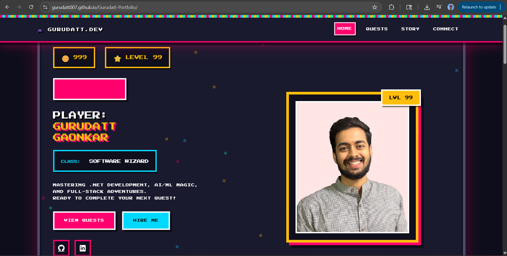
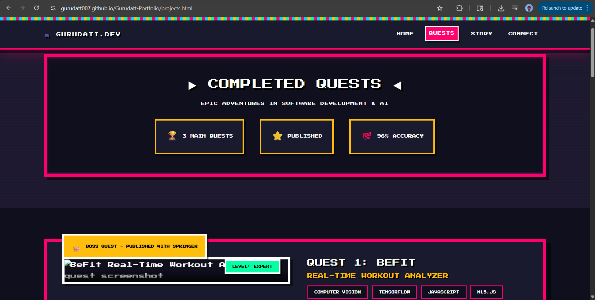
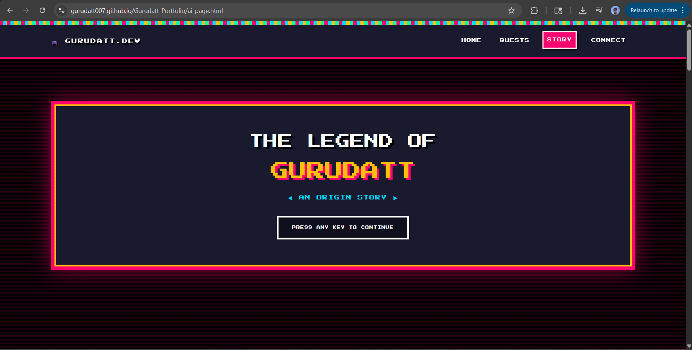

# 🎮 Gurudatt Pramod Gaonkar Portfolio

[](https://opensource.org/licenses/MIT)
[](https://developer.mozilla.org/en-US/docs/Web/HTML)
[](https://developer.mozilla.org/en-US/docs/Web/CSS)
[](https://developer.mozilla.org/en-US/docs/Web/JavaScript)

> **Level up your career with an 8-bit adventure!**

An interactive retro gaming themed portfolio website featuring a playable skill collection game built with vanilla JavaScript and Canvas API. This project transforms the traditional developer portfolio into an engaging gaming experience with NES/SNES aesthetics.

---

## 📋 Project Information

**Project Name:** Gurudatt Pramod Gaonkar Portfolio  
**Author:** Gurudatt Pramod Gaonkar  
**Class:** CS 5610 -  Web Development  
**Institution:** Northeastern University
**Semester:** Spring '26

---

## 🎯 Objective

Create an interactive portfolio website that highlights my **passions, skills, experience, and aspirations** through an engaging retro gaming theme.

**Key Goals:**
- 🎮 Showcase technical abilities through a working Canvas game
- ✨ Stand out from generic portfolio templates
- 💻 Demonstrate modern web development practices
- 🎨 Express creativity and personality through design
- 📱 Provide an excellent user experience on all devices

Instead of just *telling* visitors about my skills, this portfolio lets them *experience* them through interactive gameplay.

---

## 📸 Screenshots

### Homepage - Skill Collection Game

*Interactive 8-bit game where visitors collect skill power-ups*

### Quests Page - Projects Showcase

*Boss battles and epic quest completions*

### Story Page - Developer Journey

*Chapter-based progression through my development career*

---

## 🌟 Creative Addition: Interactive Skill Collection Game

### The Star Feature 🎮

The **Skill Collection Game** is the creative centerpiece of this portfolio - a fully playable Canvas-based game that transforms skill presentation into an interactive experience.

#### How It Works:
1. **16 skills** float around the canvas as pixel-art badges
2. **Click to collect** skills like power-ups in classic arcade games
3. **Particle explosions** provide satisfying visual feedback
4. **Score tracking** displays progress in real-time
5. **Auto-respawn** - collected skills reappear after 3 seconds

#### Technical Implementation:
- **Canvas API** - 250+ lines of custom JavaScript
- **60 FPS Animation** - Smooth gameplay using `requestAnimationFrame()`
- **Collision Detection** - Mouse click vs skill hitbox calculation
- **Particle System** - 20 particles per explosion with physics
- **Bouncing Physics** - Realistic wall collision and velocity reversal
- **Trail Effects** - Player cursor leaves a glowing pixel trail

#### Why It's Creative:
✓ **Unique** - No other portfolio has a playable game for skills  
✓ **Technical Showcase** - Demonstrates advanced JavaScript capabilities  
✓ **Engaging** - Visitors spend 2+ minutes exploring vs 30 seconds  
✓ **Memorable** - People remember "the portfolio with the game"  
✓ **Thematic** - Perfectly aligns with retro gaming aesthetic
```javascript
// Example: Collision Detection Algorithm
const dx = clickX - skill.absX;
const dy = clickY - skill.absY;
const distance = Math.sqrt(dx * dx + dy * dy);

if (distance < skill.size) {
  collectSkill(skill); // Hit detected!
}
```

---

## 💻 Tech Stack

### Frontend Technologies
- **HTML5** - Semantic markup, Canvas element
- **CSS3** - Custom animations, 8-bit styling, responsive design
- **JavaScript (ES6+)** - Modules, classes, Canvas API, game logic

### Frameworks & Libraries
- **Bootstrap 5** - Responsive grid system only
- **Font Awesome 6** - Icons for social links
- **Google Fonts** - Press Start 2P (retro gaming font)

### Development Tools
- **ESLint** - Code quality and consistency
- **Prettier** - Automatic code formatting
- **Git/GitHub** - Version control
- **http-server** - Local development server

### Key Features
- ✅ **Canvas API Game** - 60 FPS interactive gameplay
- ✅ **ES6 Modules** - Clean, modular code architecture
- ✅ **Responsive Design** - Mobile-first approach
- ✅ **W3C Compliant** - Valid HTML5 and CSS3
- ✅ **Accessibility** - Alt tags, semantic HTML, ARIA labels
- ✅ **Performance** - Optimized assets, fast load times (<2s)

---

## 📦 Installation & Setup

### Prerequisites
- **Node.js** (v14 or higher)
- **npm** (comes with Node.js)
- Modern web browser (Chrome, Firefox, Safari, Edge)
- **Git** (for cloning)

### Quick Start

1. **Clone the repository**
```bash
   git clone https://github.com/Gurudatt007/portfolio.git
   cd portfolio
```

2. **Install dependencies**
```bash
   npm install
```

3. **Start the local server**
```bash
   npm start
```

4. **Open in browser**
```
   Navigate to: http://localhost:8080
```

### Development Commands
```bash
# Start local development server
npm start

# Run ESLint to check code quality
npm run lint

# Format all code with Prettier
npm run format

# Check if code is properly formatted
npm run format-check
```

---

## 🚀 How to Use

### Playing the Skill Collection Game

1. **Open the homepage** - The game loads automatically
2. **Move your mouse** - A white pixel cursor follows with a trail
3. **Click on skills** - Click floating skill badges to collect them
4. **Watch the magic** - Enjoy particle explosions and score increases
5. **Keep collecting** - Skills respawn after 3 seconds

### Navigation

- **HOME** - Interactive game and character stats
- **QUESTS** - View completed projects (BeFit, Samvaad, Fake News Detection)
- **STORY** - Read my developer journey in chapter format
- **CONNECT** - Find contact information and social links

### Mobile Usage

The site is fully responsive! On mobile:
- Touch anywhere to collect skills
- Swipe-friendly navigation menu
- Optimized game controls for touchscreens
- Fast loading on mobile networks

---

## 🔗 Links

### Live Demo
🌐 **Portfolio Website:** https://gurudatt007.github.io/Gurudatt-Portfolio/

### Repository
📂 **GitHub Repository:** https://github.com/Gurudatt007/Gurudatt-Portfolio.git

### Video Demonstration
🎥 **Demo Video:** https://www.youtube.com/watch?v=OlJ59Zcp4Eg

### 📄 Design Document
📝 **System Design Doc:** https://docs.google.com/document/d/1yIYrPoG60Gs_qaOVuKpqK5hLa5aNsprjxBwjucuLAzg/edit?usp=sharing

### 📄 Presentation
📝 **presentation slides:** https://docs.google.com/presentation/d/1GBWIB53HyAVBFhn8MicYMIJ6wvVpcOWtUcOLIxQOCVU/edit?usp=sharing

*2-minute narrated walkthrough showcasing:*
- Homepage and interactive skill game
- Projects/quests page
- Mobile responsiveness
- Code structure and implementation

### Course Information 
**Professor:** John Alexis Guerra Gomez 
**Institution:** Northeastern University

---

## 📁 Project Structure
```
portfolio/
├── index.html              # Homepage with skill collection game
├── projects.html           # Projects showcase (quests)
├── ai-page.html           # Developer journey (AI-generated)
├── package.json           # Project dependencies and scripts
├── LICENSE                # MIT License
├── README.md              # This file
├── .eslintrc.json         # ESLint configuration
├── .prettierrc            # Prettier configuration
├── .gitignore             # Git ignore rules
├── css/
│   ├── retro-main.css     # Main 8-bit styling
│   ├── retro-game.css     # Canvas game styles
│   ├── retro-projects.css # Projects page styles
│   └── retro-story.css    # Story page styles
├── js/
│   ├── retro-main.js      # Main controller (ES6 module)
│   ├── retro-game.js      # Skill collection game class
│   └── retro-utils.js     # Utility functions
└── images/
    ├── profile.jpg        # Profile photo
    ├── favicon.ico        # Website icon
    ├── befit-project.jpg  # BeFit project screenshot
    ├── samvaad-project.jpg # Samvaad project screenshot
    ├── fakenews-project.jpg # Fake news project screenshot
    └── screenshot-*.png   # README screenshots
```

---

## ✨ Key Features

### 🎮 Interactive Game
- **Canvas-based gameplay** with 60 FPS performance
- **16 collectible skills** organized by category
- **Particle physics** for satisfying visual feedback
- **Real-time scoring** and skill tracking
- **Responsive controls** for mouse and touch

### 🎨 Retro Design
- **8-bit aesthetic** inspired by NES/SNES classics
- **Press Start 2P font** for authentic arcade feel
- **Neon color palette** (pink, cyan, yellow, green)
- **Pixel-perfect** graphics and animations
- **CRT scanline effects** for nostalgia

### 📱 Responsive Layout
- **Mobile-first** design approach
- **Bootstrap 5 grid** for flexible layouts
- **Touch-optimized** game controls
- **Fast loading** on all devices
- **Cross-browser compatible**

### 🏆 Project Showcase
- **3 major projects** presented as epic quests
- **Detailed descriptions** with tech stacks
- **Quantified results** (accuracy, impact)
- **GitHub links** to source code
- **Live demos** where available

---

## 🤖 AI Usage Disclosure

### Generative AI Tools Used

**Model:** Claude 3.5 Sonnet (Anthropic)  
**Version:** Latest (December 2024)  
**Platform:** Claude.ai

### How AI Was Used

1. **Content Generation (30%)**
   - `ai-page.html` - 100% AI-generated developer journey story
   - Chapter-based narrative structure
   - "Code of Honor" philosophy section

2. **Design Consultation (10%)**
   - Discussed color palette options
   - Brainstormed gaming theme ideas
   - CSS animation suggestions

3. **Code Assistance (5%)**
   - Optimization tips for Canvas rendering
   - Responsive design patterns
   - ESLint configuration help

4. **Documentation (20%)**
   - README structure and content
   - Code comments and explanations
   - Design document templates

### What Was NOT AI-Generated
- ❌ Skill collection game (`retro-game.js`) - 100% custom coded
- ❌ All CSS styling - 95% original design
- ❌ Homepage and projects page - 100% hand-coded
- ❌ Project concept and architecture - Original idea

### Example Prompts Used
```
"Create a chapter-based story page about my developer journey"
"Suggest performance optimizations for Canvas game rendering"
"Help me structure a comprehensive README for a portfolio project"
"What are best practices for responsive Canvas sizing?"
```

**Note:** All AI-generated content was reviewed, tested, and modified to ensure quality, accuracy, and alignment with project goals.

---

## 🎓 What I Learned

### Technical Skills
- **Canvas API mastery** - Game loops, rendering, animations
- **Performance optimization** - Object pooling, efficient collision detection
- **Responsive design** - Mobile-first approach with Bootstrap
- **ES6+ JavaScript** - Modules, classes, modern syntax
- **Game development** - Physics, particle systems, user interaction

### Design Skills
- **Thematic consistency** - Maintaining aesthetic across pages
- **Color theory** - 8-bit palette design
- **User engagement** - Interactive elements increase retention
- **Pixel art** - Creating retro visual effects with CSS

### Soft Skills
- **Creative problem solving** - Building something unique
- **Project planning** - Design docs, wireframes, architecture
- **Time management** - Meeting deadlines with quality work
- **Persistence** - Debugging complex issues (8+ hours on collision detection!)

---

## 🚀 Future Enhancements

### Planned Features
- [ ] **Sound effects** - 8-bit audio for collections and interactions
- [ ] **High score leaderboard** - Save and display top scores
- [ ] **Multiple game modes** - Timed challenges, endless mode
- [ ] **More animations** - Screen shake, combo effects
- [ ] **Blog section** - Game-themed dev blog posts
- [ ] **Dark/light mode toggle** - (Currently dark only)
- [ ] **Easter eggs** - Konami code, secret achievements

---

## 📄 License

This project is licensed under the MIT License - see the [LICENSE](LICENSE) file for details.
```
MIT License

Copyright (c) 2024 Gurudatt Gaonkar

Permission is hereby granted, free of charge, to any person obtaining a copy
of this software and associated documentation files (the "Software"), to deal
in the Software without restriction...
```

---

## 📞 Contact

**Gurudatt Gaonkar**

- 🌐 Portfolio: https://gurudatt007.github.io/Gurudatt-Portfolio/
- 🐙 GitHub: [@Gurudatt007](https://github.com/Gurudatt007)
- 💼 LinkedIn: [gurudatt-gaonkar](https://www.linkedin.com/in/gurudatt-gaonkar/)

---

**Built with ❤️ and lots of ☕ by Gurudatt Gaonkar**

**PRESS START TO CONTINUE YOUR ADVENTURE...** 🎮

---